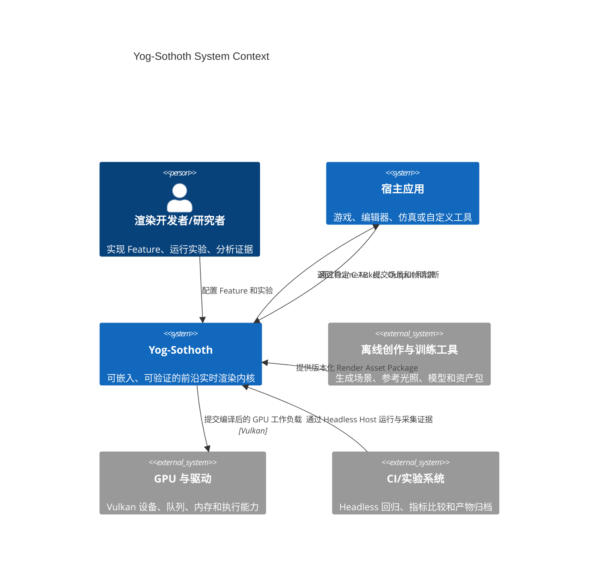
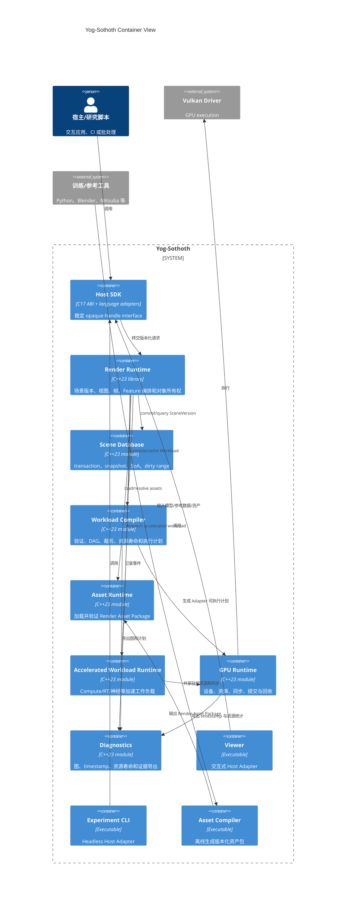

# C4：系统上下文与容器

## Level 1：System Context

### 系统职责

Yog-Sothoth 负责渲染执行、资源生命周期、工作负载编译、能力选择与诊断。它不负责通用游戏逻辑、资产创作、神经模型训练或完整编辑器。

## Level 2：Container

## 部署形态

Phase 1 只有单进程部署：Viewer 或 Experiment CLI 与 Runtime 位于同一进程。跨进程 Worker 是未来 Host Adapter，不进入首阶段。

Runtime 可以作为静态库或动态库构建，但二者必须暴露相同 C ABI。语言 SDK 只做类型安全和生命周期包装，不复制业务逻辑。
