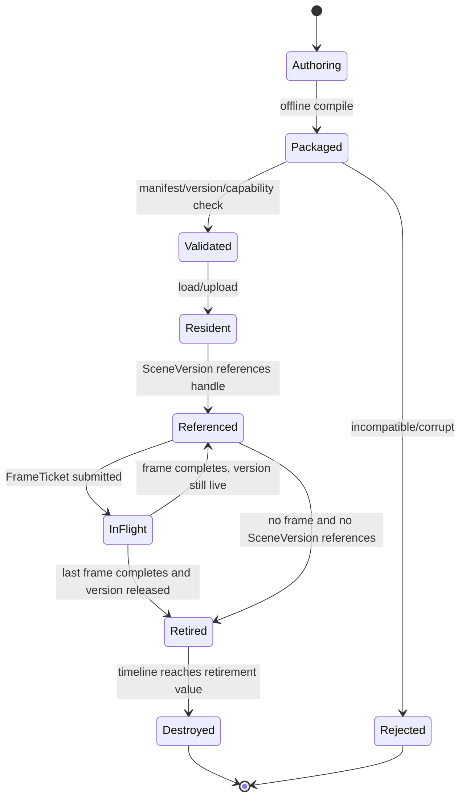
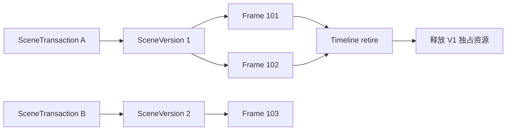

# 场景与资源生命周期

## 从创作数据到 GPU 回收

## SceneVersion

- commit 创建新版本，不原地修改旧版本可见状态；
- 资源句柄可在版本之间共享；只有最后一个引用退休后才能释放；
- SceneVersion 内容变化不得自动导致 Workload 重编译；
- 删除操作进入 deferred destruction，不能立即释放 GPU 内存。

## 不同资源的生命周期规则

### Transient

仅在一个 Compiled Plan 的逻辑帧内有效。Workload Compiler 根据 first-use/last-use 安排物理内存；handle 不允许逃逸到下一帧。

### Persistent

由 Asset Runtime 或 Runtime 创建，通过 stable handle 引用。其销毁由引用计数/版本引用与 GPU timeline 共同决定。

### History

由 Feature 声明、Runtime 分配和轮换。Feature 只能通过当前/上一版本逻辑 handle 访问，不能缓存原生 GPU handle。

### External

由 Host 或 Output Adapter 提供。导入时必须声明格式、尺寸、usage、当前状态、所有队列和释放契约；Runtime 不拥有其最终内存。

### Readback

由 Output Adapter 发起异步复制。只有 FrameTicket 完成后宿主才可读取；映射结果的有效期必须显式结束。

## Residency seam

Phase 1 只实现全量驻留，但资源描述中保留 package id、content hash、size 和 residency class。分页、GPU feedback 和预算驱逐属于 Phase 2，不在首阶段创建伪实现。

