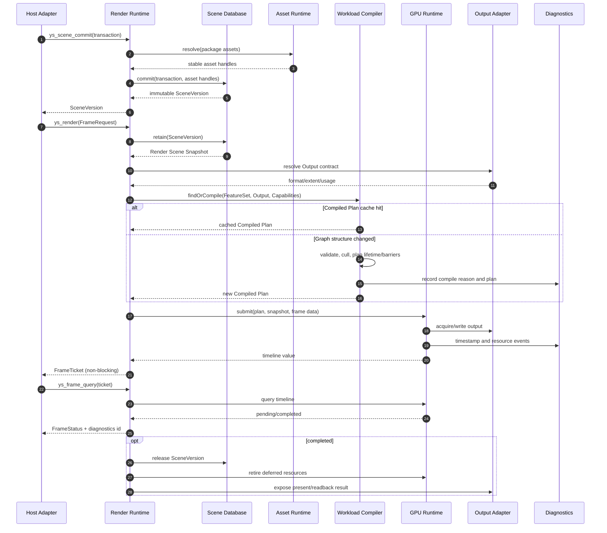

# Runtime 帧执行时序

## 正常帧

## 线程与阻塞约束

- `ys_render` 只提交工作并返回 `FrameTicket`，不得等待 GPU 完成。
- SceneTransaction 可以在宿主线程构建；commit 在 Phase 1 串行进入 Runtime。
- Vulkan Adapter 可以拥有内部提交线程，但不得从未声明线程调用宿主回调。
- Headless readback 只有在对应 ticket 完成后才允许映射。
- 稳定帧不得进行文件 I/O、shader 编译、pipeline 创建或 CPU 阻塞等待 GPU。

## Compiled Plan 稳定性

以下变化不触发重编译：

- 相机矩阵；
- transform；
- 材质参数；
- SceneVersion 内容；
- Neural/Grid 参数值。

以下变化可以触发重编译，并必须记录原因：

- Feature 拓扑；
- Output 格式或尺寸类别；
- capability/fallback 路径；
- pass 资源契约；
- shader/pipeline package 兼容性变化。

## 故障路径

任何阶段失败均返回结构化错误：错误码、所属子系统、稳定消息和 diagnostics id。Runtime 必须保证失败请求不会部分提交场景版本，也不会泄漏或提前释放在途资源。

