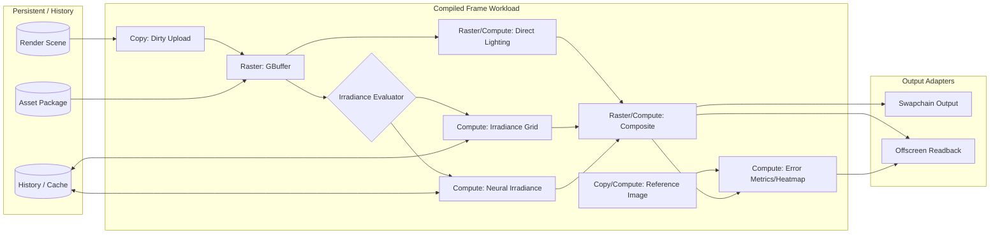
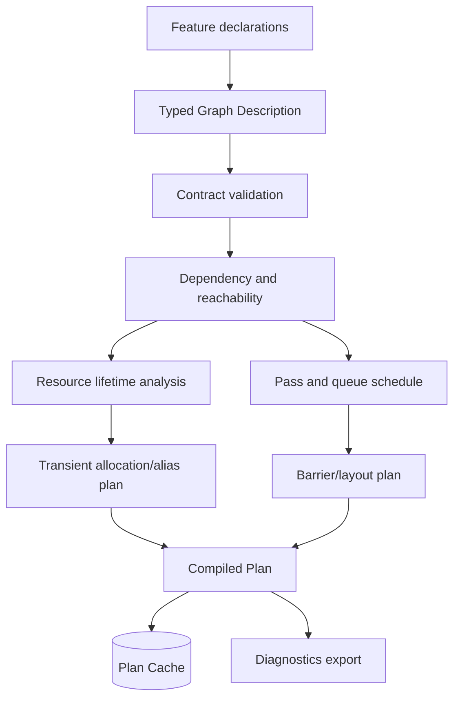

# GPU 工作负载视图

## Neural Irradiance 纵切

`Grid` 与 `Neural` 是 Irradiance evaluator seam 上的 Adapter；编译策略一次只选择所需路径，不会在正常帧同时执行两者，除非实验配置明确要求对比。

## Workload Compiler 内部视图

这些步骤属于 Workload Compiler 的内部实现，不形成多个公共 interface。调用者只提交描述并取得不可变 Compiled Plan。

## Phase 1 调度约束

- 以单 graphics queue 完成正确性闭环；
- Compute pass 在 IR 中是独立类型，但首阶段可以映射到 graphics queue；
- Copy 可映射到 graphics queue，接口不得假定该映射永久成立；
- Phase 2 才启用跨队列重排、尽早 signal/尽晚 wait；
- External/Unsafe pass 必须声明副作用、输入/输出状态，并在图中高亮。

## 资源类别

| 类别 | 所有权 | 典型用途 | 编译器行为 |
|---|---|---|---|
| transient | Runtime | GBuffer、中间光照 | 分析寿命并允许 alias |
| persistent | Runtime/Asset | mesh、material、模型权重 | 跨帧保留，不参与 transient alias |
| history | Feature 经 Runtime 管理 | 时空缓存、前一帧结果 | 显式版本和帧间依赖 |
| external | Output/Host | swapchain、导入纹理 | 显式 acquire/release 状态 |
| readback | Output | 图片和指标 | 异步复制，ticket 完成后读取 |

