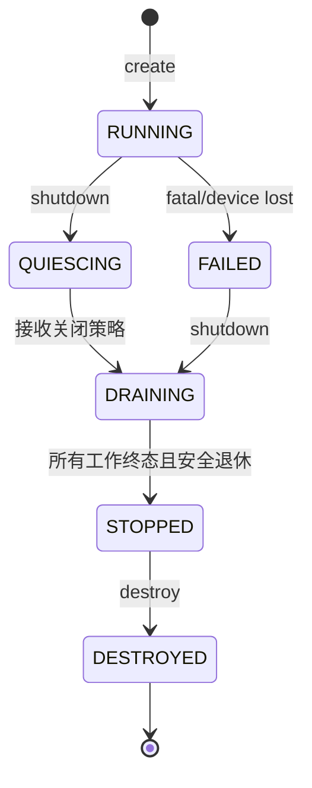
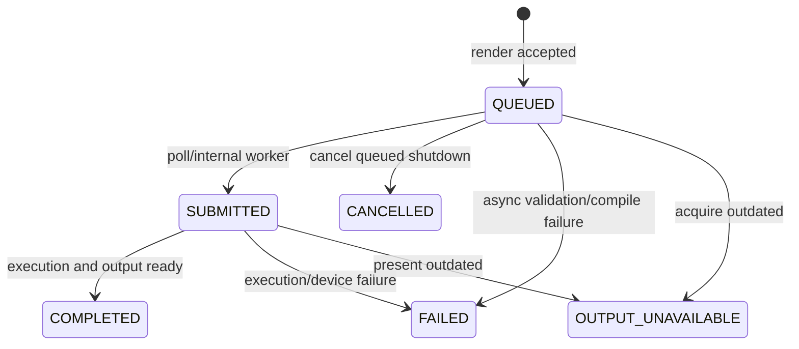

# Runtime Host C ABI v1 设计

Status: candidate baseline

Normative public header: [runtime.h](../../include/yog_sothoth/runtime.h)

## 1. 目标

Runtime Host C ABI 是 Viewer、Headless CLI、未来游戏/编辑器和语言 SDK 使用 Yog-Sothoth 的唯一稳定外部 seam。它需要：

- 保持 C17 ABI 和跨编译器可用性；
- 不暴露 Vulkan、C++、Workload IR 或内部对象地址；
- 表达异步帧、不可变场景版本和安全 GPU 退休；
- 支持确定性 Validation Adapter 和未来高吞吐执行；
- 为错误、线程、所有权和生命周期提供可测试定义。

## 2. 设计选择摘要

| 主题 | v1 选择 |
|---|---|
| 根对象 | `ys_runtime*` opaque pointer |
| 子对象 | 带 generation 的 `uint64_t` opaque handle |
| ABI 演进 | `struct_size + abi_version + structure_type + next` |
| 字符串 | UTF-8 字节串；输入携带长度；错误写入 Host 可选定容缓冲 |
| 进度模型 | Phase 1 采用 Host-pumped；`poll` 是唯一显式推进入口 |
| 控制线程 | 创建 Runtime 的线程；mutation、render、poll、shutdown 串行进入 |
| 观察与引用释放 | frame/state/diagnostic query 允许并发；SceneVersion/FrameTicket release 允许任意 Host 线程 |
| 销毁 | `shutdown → poll/get_state → STOPPED → destroy` |
| 错误 | 稳定 `ys_result` + 结构化 `ys_error_info` + Host 可选 UTF-8 文本缓冲 |
| 异步错误 | FrameStatus 携带 result 和 diagnostics id |
| 测试 seam | 仅 Host C ABI |

## 3. ABI 规则

所有可扩展结构的前三个字段均为：

```c
uint32_t struct_size;
uint32_t abi_version;
uint32_t structure_type;
uint32_t reserved;
const void* next;
```

规则：

1. `abi_version` 表示 ABI major；v1 为 `YS_ABI_MAJOR_1`，破坏性布局/语义变化才提升 major；
2. `ys_query_abi(out_info_size, out_info, error)` 是无需 Runtime 的永久版本查询入口；Runtime 最多写入 `out_info_size` 字节，未来扩展 `ys_abi_info` 不会越界旧调用者；结构尾部演进不提升 ABI major；
3. Host 将结构清零，再设置 `struct_size`、`abi_version` 和 `structure_type`；
4. Runtime 只读取 `min(struct_size, known_size)` 范围；小于强制前缀时返回 INCOMPATIBLE_ABI；
5. 已知结构的额外尾字段忽略，缺失尾字段使用文档默认值；
6. 扩展 `structure_type` 的高位 `YS_STRUCTURE_REQUIRED_BIT` 表示 required；未知 optional 扩展忽略，未知 required 扩展返回 UNSUPPORTED_CAPABILITY；
7. 重复扩展、错误 parent、错误尺寸或环链返回 INVALID_ARGUMENT；扩展顺序不影响语义；
8. 保留字段必须为零；失败的输出 handle 置为 INVALID，输出指针置为 NULL；
9. ABI 字段使用固定宽度整数，不直接使用 C enum/_Bool；尺寸和 offset 使用 `uint64_t`；
10. DLL 符号统一使用 `YS_API` 和 `YS_CALL`；Windows 动态库固定 `__cdecl`，并区分 `YS_BUILD_DLL`/`YS_STATIC`；
11. Runtime 内存只能由 Runtime 对应 release/destroy 释放，Host 缓冲只能由 Host 释放；未来 allocator 只能通过 required/optional 扩展加入；
12. 冻结前生成 MSVC/Clang-cl/C/C++ 的 `sizeof/alignof/offsetof` ABI 清单，禁止非默认 packing。

### 3.1 Record stream

SceneCommand 与 FeatureConfig 使用字节 record stream，不使用固定 stride 数组：

```text
record_size | kind | payload | padding-to-8
```

- `record_size` 包含 header、payload 和 padding，是 8 的倍数；
- 最小为当前 kind 的强制前缀，最大为 64 KiB；
- Runtime 以 byte size 为总边界，按 `record_size` 前进；
- 未知 kind 返回 UNSUPPORTED_CAPABILITY，错误大小/对齐返回 INVALID_ARGUMENT；
- Runtime 在调用返回前深拷贝完整 stream。

## 4. 对象模型

```text
Runtime
├─ SceneTransaction   Host 可变 builder
├─ SceneVersion       不可变 snapshot handle
├─ View               可更新；render 时捕获 revision
├─ Output             可更新；render 时捕获 revision
├─ AssetPackage       离线编译资产的运行时引用
├─ FeatureProfile     Host 功能配置；不暴露 Workload IR
└─ FrameTicket        Host 的异步观察 handle
```

除 Runtime 外，handle 值只具有身份含义，Host 不能解引用或拆分。实现必须检测：

- zero/invalid handle；
- 类型错误；
- generation mismatch；
- 已释放 handle；
- cross-runtime handle。

所有 C handle 共享 64 位表示是 ABI 选择，不是类型可互换承诺。C++/Rust/Zig SDK 必须提供强类型 wrapper；契约测试覆盖每一种 wrong-kind 组合。实现不得把指针直接编码成 handle，也不得向 Host 公开 instance tag/slot/generation 位布局。

## 5. 所有权

| 对象 | Host 如何获得 | Host 如何释放 | Runtime 内部保留 |
|---|---|---|---|
| Runtime | `ys_runtime_create` | `shutdown` 完成后 `destroy` | 根所有者 |
| SceneTransaction | `transaction_begin` | `abort` 或成功 commit 消费；失败保留 | commit 接受时移动命令 |
| SceneVersion | `scene_commit` | `scene_version_release` | 在途帧自动保留至退休 |
| View | `view_create` | `view_destroy` | render 捕获 revision |
| Output | `output_create` | `output_destroy` | render 捕获 revision/外部契约 |
| AssetPackage | `asset_package_load` | `asset_package_release` | Scene/Profile/在途帧自动保留 |
| FeatureProfile | `feature_profile_create` | `feature_profile_destroy` | render 捕获 revision |
| FrameTicket | `ys_render` | `frame_release` | 工作、状态、输出和诊断保留至退休 |

### 5.1 SceneTransaction

- 由 Host 独占，非线程安全；
- `transaction_write` 批量复制 typed commands；
- commit 返回 `YS_OK` 时消费 transaction，Runtime 取得全部命令所有权，原 handle 立即失效；
- commit 返回任何非 `YS_OK` 时不消费 transaction，命令内容、顺序和 base version 必须保持不变，Host 可以重试或 abort；
- commit 失败时 `out_version` 必须为 `YS_INVALID_HANDLE`，成功时必须返回非零 SceneVersion；
- abort 成功消费 transaction；消费后原 handle 立即失效，再次 abort 返回 INVALID_HANDLE；
- 实现必须在移动命令缓冲前完成同步验证和容量预留，形成原子的接受点，不能在部分修改 Scene Database 后返回失败。

### 5.2 SceneVersion

- commit 成功返回一份 Host 引用；
- 版本不可变，ID 在 Runtime 生命周期内单调递增且不为零；
- render 成功接受请求时取得内部引用；
- Host 可以在帧完成前 release，底层 snapshot 仍保留；
- 最后一个 Host 引用和最后一个在途引用消失后，资源进入 timeline retirement。

### 5.3 View 与 Output

- update 产生新 revision，不修改在途帧已经捕获的 revision；
- View destroy 是逻辑销毁：拒绝新 render，但在途帧继续安全使用旧 revision；
- Output destroy 是逻辑销毁：立即拒绝新 render；在途 FrameTicket 内部保留不可变 Output revision，旧 swapchain/readback 资源延迟退休；
- Runtime 不取得外部窗口/图像的最终所有权；扩展结构必须定义 acquire/release 契约。

### 5.4 FrameTicket

- `ys_render` 成功返回一份 Host 引用；
- release 只放弃观察权，不取消已接受工作；
- 终态可以重复 query，直至 release；
- readback 数据至少保留到 ticket release；基础 v1 通过 FrameTicket-only map/unmap 暴露只读 lease。

### 5.5 跨线程 release

- `scene_version_release` 与 `frame_release` 可从任意 Host 线程调用；
- 恰好一个并发 release 成功，重复 release 返回 `YS_ERROR_INVALID_HANDLE`；
- release 只消费 Host 引用，不直接销毁 GPU 资源；Runtime 通过并发 Release Inbox 将实际回收交给 Progress Engine；
- Phase 1 可使用简单 mutex queue，不要求无锁实现；
- View/Output destroy、Transaction 操作、render、poll、shutdown 和 destroy 仍遵循 control/owner thread；
- Runtime destroy 前，Host 必须停止并 join 自己的调用线程，确保没有在执行的 ABI 调用。

### 5.6 Readback lease

- v1 每帧只有一个 Output，readback 仅绑定 FrameTicket；ticket 保存不可变输出元数据，不要求原 Output handle 存活；
- 仅 `COMPLETED` FrameTicket 可以 map；QUEUED/SUBMITTED 返回 NOT_READY，FAILED/CANCELLED 返回 INVALID_STATE；
- map 返回 Runtime-owned 的只读借用指针，包含 size、row pitch、width、height、format 和 color space；
- 每个 ticket 最多一个 active map；unmap 必须由执行 map 的同一 Host 线程调用；
- mapped 时 `frame_release` 返回 BUSY，不能让指针静默失效；
- shutdown 后仍允许 unmap；存在 active map 时 Runtime 不能进入 STOPPED；
- v1 只定义单平面 RGBA8_UNORM 和 RGBA16_FLOAT，多平面格式以后通过版本化扩展增加。

### 5.7 Future frame wait

v1 不提供 `ys_frame_wait`。Host-pumped 的 control thread 必须使用 `poll + frame_query`，避免阻塞后无人推进 Runtime。真实跨线程帧消费者或 Dedicated Adapter 出现后，可以向 ABI 新增 wait interface，但必须遵守：

- wait 只等待已发布状态，绝不隐式 poll 或推进 Progress Engine；
- Host-pumped 的 control thread 不得对未完成 ticket 阻塞等待；
- timeout 不消费 ticket；
- active waiter 阻止 ticket release；
- shutdown cancel、device lost 和 terminal state 必须唤醒 waiter。

### 5.8 AssetPackage 与 FeatureProfile 生命周期

- `asset_package_load` 返回 Host 引用；SceneTransaction write、FeatureProfile create/update 和已接受 Frame 会取得所需 package 的内部引用；
- Transaction 写入成功后 Host 可以 release package，transaction 仍保持其资产引用直到 abort、commit 失败后由 Host abort，或 commit 成功转移给 SceneVersion；
- package release 只消费 Host 引用，不破坏 Transaction、SceneVersion、Profile 或在途 Frame；最后一个内部引用消失后由 Progress Engine 退休；
- FeatureProfile update 产生新 revision，render 接受时捕获 revision；destroy 拒绝新 render，但不破坏已接受 Frame；
- package/profile release/destroy 在 control thread 调用；stale、wrong type 和 cross-runtime handle 均返回 INVALID_HANDLE。
- Transaction/Profile 可以捕获 QUEUED package；render 接受请求并建立 readiness 依赖，Frame 保持 QUEUED 且占 execution capacity；
- package READY 后 Frame 继续推进；package FAILED 使依赖 Frame 进入 FAILED 并继承 diagnostics；
- shutdown DRAIN 继续推进被引用 package，CANCEL_QUEUED 取消仍在等待 package 的 Frame 并释放其内部引用；

### 5.9 Frame evidence reports

FrameTicket 按 `FrameRequest.report_capture_flags` 保留成功或失败帧的只读证据，Host 使用两段复制 `ys_frame_report_copy_json` 导出：

- workload：Compiled Plan 标识、pass/dependency、裁剪、barrier/queue 和重编译原因；
- timings：CPU scene/compile/submit、逐 pass GPU timestamp、p50/p95 所需原始帧值；
- metrics：MSE、PSNR 和 Feature 产生的实验指标；
- resources：资源寿命、峰值、transient alias、pipeline cache；
- provenance：Runtime/ABI、设备/驱动、package/shader/model content hash 和 FeatureProfile revision。

报告是观测结果，不允许 Host 创建或修改 Workload IR。默认 capture flags 为 0，不启用逐 pass timestamp、资源追踪或 JSON 预生成；BASIC_PROVENANCE 是低成本 opt-in。未捕获类型返回 NOT_CAPTURED。Runtime 保存结构化记录，只有 copy 时生成 JSON。

`destination == NULL` 查询 required size；required size 按 UTF-8 字节计数并包含终止 NUL。容量不足返回 BUFFER_TOO_SMALL，有容量时始终 NUL 终止；JSON 不允许内嵌 NUL。终态发布前冻结每类 report blob 的逻辑内容，required size 和字节内容在 ticket 生命周期内不变。QUEUED/SUBMITTED 返回 NOT_READY；FAILED/CANCELLED 可以提供已请求的部分报告并明确缺失字段原因。

## 6. Runtime 状态与销毁



### Shutdown 模式

- `YS_SHUTDOWN_DRAIN`：拒绝新 mutation/render，完成所有已接受工作；
- `YS_SHUTDOWN_CANCEL_QUEUED`：取消尚未提交的帧，已提交工作仍安全退休；
- 不提供 `force destroy` 或承诺强杀 GPU 的 immediate 模式。

### 调用语义

- `ys_runtime_shutdown` 非阻塞且幂等；首次调用进入 QUIESCING；
- 相同模式重复调用成功；从 DRAIN 升级为 CANCEL_QUEUED 允许，反向降级返回 `INVALID_STATE`；
- Host-pumped 模式必须继续调用 `poll` 才能进入 STOPPED；
- v1 不提供 `wait_shutdown`；阻塞便利由语言 SDK 使用 poll/state 封装，Dedicated 成为真实能力后再新增 wait interface；
- `shutdown` 不隐式推进工作，`get_state` 只观察，`poll` 是唯一显式进度入口；
- `destroy` 仅接受 STOPPED；其他状态返回 BUSY/INVALID_STATE，不隐式无限等待；
- destroy 成功后所有子 handle 立即 stale。

### Device-lost teardown

- device lost 原子地进入 FAILED，所有 QUEUED/SUBMITTED ticket 发布为 FAILED，禁止新的后端提交；
- 正常 timeline/fence 不再作为退休依据，Runtime 执行 backend 的 device-lost teardown；
- CPU 侧 active readback lease 仍必须由 Host unmap；已冻结的 CPU report/diagnostic 仍可查询；
- FAILED 状态调用 shutdown 时，DRAIN 退化为失败清理，不承诺完成渲染；
- 清理 Release Inbox、CPU pins 和 active leases 后允许进入 STOPPED；报告明确哪些 GPU 数据缺失。

### STOPPED 与 destroy

- STOPPED 只要求 command cutoff 前的工作终态、GPU/backend 清理完成、Release Inbox drain 且无 active lease；
- 进入 STOPPED 前，Runtime 将仍由 Host handle 持有的对象 detach 为 CPU-only tombstone/snapshot：所有 GPU/internal execution 引用已退休；
- SceneVersion/Package/Profile/View/Output tombstone 只允许 release/destroy 和必要的 CPU 状态查询；FrameTicket 允许 query、冻结 report 和已完成 readback map；不允许任何 mutation/render/load；
- STOPPED 状态的 release 同步释放 CPU 内存，不依赖 backend 或再次 poll；active readback lease 仍阻止 STOPPED；
- `runtime_destroy` 要求全部 Host handles 已 release 且没有正在执行的 ABI 调用，否则返回 BUSY；
- destroy 成功后不存在仍承诺可查询的子对象。

## 7. Frame 状态



- `COMPLETED`、`FAILED`、`CANCELLED`、`OUTPUT_UNAVAILABLE` 是稳定终态；
- `frame_query` 只观察，不推进状态；
- Validation Adapter 通过 `poll` 确定性推进 `QUEUED → SUBMITTED → COMPLETED`；
- `ys_render` 本身不等待 GPU，也不在返回前同步完成 ticket；
- `COMPLETED` 表示 Output 可 present 或 readback；GPU 内部退休可以随后发生。

## 8. SceneTransaction 命令

v1 使用批量 tagged command，避免为每种场景字段增加浅函数。首阶段定义：

- CREATE_OBJECT；
- DESTROY_OBJECT；
- SET_TRANSFORM；
- SET_MESH；
- SET_MATERIAL；
- SET_LIGHT。

命令 record 包含 `record_size`，按第 3.1 节字节流规则扩展。`ys_object_id` 由 Host 分配，必须非零且在 Runtime 生命周期内不复用；重复 CREATE 或引用不存在对象返回 VALIDATION_FAILED。Mesh/Material 使用 package-scoped `ys_asset_ref`。Camera 由 View 表达，不重复进入 SceneTransaction。所有矩阵使用 column-major 4×4 float，并在右手坐标系中解释；坐标和单位的最终决定需要单独 ADR。

## 9. View 与 Output

View v1 定义 view/projection matrix、viewport 和 revision。Output v1 定义：

- Validation：无像素输出，仅验证执行契约；
- Offscreen Readback：异步图像输出；
- Swapchain：由平台扩展结构提供 native window 信息。

基础 ABI 中 `format` 和 `color_space` 使用 Yog-Sothoth 自有稳定枚举，不等同 Vulkan 数值。

Offscreen 数据由 `ys_frame_map_readback`/`ys_frame_unmap_readback` 借用。Runtime 不负责 PNG、视频或文件输出；Host 可以直接编码、计算指标，或复制到自己的长期存储。

Win32 Swapchain 使用 `ys_output_win32_swapchain_ext`，通过带 `YS_STRUCTURE_OUTPUT_WIN32_SWAPCHAIN_EXT` 的扩展链提供 `hwnd/hinstance`；基础 ABI 不包含 `windows.h` 或 Vulkan 类型。

View 使用显式 viewport rect；v1 不做隐式缩放或 letterbox，rect 必须完全落在 Output extent 内。viewport 尺寸或 Output extent 变化会使 history 失效，并可按尺寸类别触发计划重编译；仅位置变化不触发重编译。

### 9.1 Asset Package 与 Feature Profile

`ys_asset_package_load` 从 Host-owned immutable blob 接受版本化 Render Asset Package；Runtime 在返回前复制/接管内部表示，不保留 Host 指针。路径、VFS、archive、网络和 memory mapping 属于 SDK/Host。load 返回 QUEUED package，解析/验证/GPU readiness 由 Progress Engine 推进，并通过 `asset_package_query` 返回 READY/FAILED。SceneCommand 和 FeatureConfig 以 `package + asset_id` 引用资产；package 有 Host 引用和内部引用。

Host 通过 `ys_feature_profile_create/update/destroy` 配置 Direct、Grid、Neural、Reference 和 Error View。Profile 是 Host 配置 seam，不是 Workload IR；render 接受请求时捕获 profile revision。Feature 拓扑变化可以触发 Compiled Plan 重编译，参数值变化不得触发。

FeatureProfile v1 契约：

- `frame_request.feature_profile` 必须是有效非零 handle；
- Profile 可以为空，表示只执行清屏/输出生命周期验证；
- 每种 Feature 最多出现一次，record 顺序不影响语义，Runtime 按 kind 规范化；
- DirectLighting 不使用资产，`intensity_scale >= 0`；
- IrradianceGrid 需要 manifest 类型为 IrradianceGrid 的 asset；
- NeuralIrradiance 需要 manifest 类型为 NeuralModel 的 asset；
- ReferenceImage 需要尺寸/格式兼容的 ReferenceImage asset；
- ErrorView 不使用资产，但要求同一 Profile 包含 ReferenceImage，以及 Grid 或 Neural 之一；
- IrradianceGrid 与 NeuralIrradiance 在一个 Profile 中互斥；两者对比使用两个 Frame/Profile，避免同一最终光照输出含糊；
- `enabled == 0` 的条目忽略，但仍校验结构和保留字段；未知 kind、重复 kind、资产类型错误或非法组合返回 VALIDATION_FAILED；
- `metric_flags == 0` 在 v1 表示 MSE + PSNR，未知位返回 INVALID_ARGUMENT。

所有公开 `flags` 字段在 v1 必须为 0；非零未知位返回 INVALID_ARGUMENT。后续只有出现真实语义时才分配稳定 bit。

### 9.2 Win32 Swapchain 契约

- `hwnd` 和 `hinstance` 必须非空，窗口由 Host 创建并最终拥有；
- Win32 窗口必须由 Runtime control thread 所在线程拥有，Host 负责该线程的消息泵；
- 两个 native handle 从 `output_create` 开始必须保持有效，直到 `output_destroy` 返回；destroy 停止新的 acquire/present，返回后 Host 可以销毁窗口，在途 Frame 可能以 OUTDATED/SURFACE_LOST 结束；
- client size 改变后，Host 在 control thread 调用 `output_update` 提交新 width/height；在途帧继续使用捕获的 Output revision；
- 窗口最小化时允许 width/height 为 0，此时新 render 返回 NOT_READY，不创建 0 尺寸 swapchain；
- surface lost 或 native window 失效使相关 Frame 进入 FAILED，result 为 SURFACE_LOST；Host release tickets、destroy Output 后，以有效窗口重新创建；
- Runtime 不处理 Win32 消息，不销毁 HWND，也不静默替换 Host 窗口。
- Runtime 负责 acquire 和 present；Swapchain Frame 的 COMPLETED 表示 present 已成功排队，不表示像素已经显示；
- OUTDATED 表示 resize/模式变化，Host 应调用 `output_update`；SUBOPTIMAL 是可继续 present 的状态并提示更新；SURFACE_LOST 仅表示 surface 不可恢复；
- Host 请求 format/color space/present mode，Runtime 按 capability 选择；`output_get_info` 返回实际值和 revision，禁止静默 HDR/SDR fallback；
- v1 支持 FIFO、MAILBOX、IMMEDIATE；不可用模式在 create/update 返回 UNSUPPORTED_CAPABILITY，并在预创建 output capability query 中报告；
- poll 不进行无界 acquire 等待；不可立即 acquire 时报告 blocked reason 并在预算内返回。
- `output_destroy` 返回前建立 WSI cutoff：取消所有尚未发起 acquire/present 的工作，并保证返回后不再读取 HWND/HINSTANCE 或发起新 WSI 调用；
- 未 acquire 的相关 Frame 进入 CANCELLED；已 acquire 但尚未 present 的 Frame 进入 OUTPUT_UNAVAILABLE；已经排队 present 的 Frame 保留其最终 WSI 结果，驱动完成观察不得再次读取 Host native handle；

Swapchain 结果矩阵：

| 阶段/结果 | FrameState | FrameStatus.result | 输出/报告 |
|---|---|---|---|
| acquire OUTDATED | OUTPUT_UNAVAILABLE | STATUS_OUTPUT_OUTDATED | 无输出；已请求 report 可部分提供 |
| acquire SURFACE_LOST | FAILED | ERROR_SURFACE_LOST | 无输出；失败诊断可用 |
| present success | COMPLETED | OK | present 已排队；已请求 report 可用 |
| present SUBOPTIMAL | COMPLETED | STATUS_OUTPUT_SUBOPTIMAL | 输出有效；Host 应更新 Output |
| present OUTDATED | OUTPUT_UNAVAILABLE | STATUS_OUTPUT_OUTDATED | 渲染可能执行但未承诺显示；report 标记阶段 |
| present SURFACE_LOST | FAILED | ERROR_SURFACE_LOST | 输出不可用；失败诊断可用 |

## 10. 线程模型

完整比较见 [runtime-threading-models.md](runtime-threading-models.md)。候选枚举进入 ABI，以 capability 表示实现支持范围；Phase 1 只承诺：

```text
YS_THREADING_HOST_PUMPED
```

已接受的附加约束：Host-pumped 只是正式 Progress Driver，不是 Runtime 核心实现模型。内部必须将 ABI command intake、线程无关的 Progress Engine 和 Progress Driver 分离：

```text
Host C ABI
    ↓ immutable commands
Runtime Command Intake
    ↓
Progress Engine
    ↑
Progress Driver
    ├─ HostPumpDriver
    └─ Validation DedicatedDriver spike
```

`ys_runtime_poll` 只是 HostPumpDriver 调用 `ProgressEngine::advance(budget)` 的入口。状态迁移、工作负载推进和资源退休不得散落在 `poll`、`query` 或其他 ABI 函数中。ABI 冻结前必须用 Validation Adapter 实现最小 DedicatedDriver spike，并让两个 Driver 通过同一套 Host C ABI 契约测试；DedicatedDriver spike 不等于 Phase 1 对外承诺 Vulkan Dedicated 模式。

规则：

- 创建 Runtime 的线程成为 control thread；
- create/package/profile/begin/write/abort/commit/view/output mutation/render/poll/shutdown/destroy 在 control thread 串行调用；
- transaction 只能由创建它的线程访问；
- frame query、runtime state query、diagnostic query/copy 可从任意 Host 线程并发调用；
- SceneVersion 和 FrameTicket release 允许任意 Host 线程，通过 Release Inbox 延迟交给 Progress Engine；
- View/Output destroy 和其他 mutation 保持 control thread；
- ABI 不提供任意内部线程 callback；未来回调只能由 Host 主动 dispatch。
- v1 不提供阻塞式 frame wait；Host 使用 poll/query，未来真实异步消费者出现后再增加只等待、不推进的 interface。

### 10.1 线性化与可见性

- 每个成功接受的 mutation/render 获得单调 command sequence；HostPump 与 Dedicated 必须按该序列消费；
- shutdown 的线性化点建立 acceptance cutoff：cutoff 前命令按 drain/cancel 规则处理，cutoff 后 mutation/render 同步返回 INVALID_STATE；
- 每个 handle 操作进入时先取得短期 operation pin。release 使用 CAS 将 HostOwned 转为 ReleasePending：普通操作先 pin 则可完成，release 随后成功并延迟实际回收；release 先线性化则后续操作返回 INVALID_HANDLE；只有 active readback map 等 durable lease 使 release 返回 BUSY，BUSY 不消费 handle，Host 可重试；
- handle identity 由 runtime instance tag、object type、slot 和 generation 组成；instance tag 在进程生命周期内绝不复用，空间耗尽时 runtime_create 失败；generation wrap 时永久退休 slot，不能使 stale handle 重新有效；
- FrameStatus 以不可变 publication revision 发布。终态发布与 query/map/report 之间具有 release/acquire 可见性：观察到 COMPLETED 后，readback bytes、report 和 diagnostics 必须全部可见；
- Release Inbox enqueue/dequeue 具有同等发布/获取语义；这些是行为保证，不向 Host 暴露语言级 memory-order；
- report/diagnostic copy 在入口取得 operation pin，和 release 遵守同一线性化规则。

### 10.2 Shutdown 与取消边界

- Frame job 越过 backend submission reservation 后视为 SUBMITTED；CANCEL_QUEUED 只取消尚未越过该边界的 Frame；
- 被取消 Frame 释放其 scene/profile/output/package 内部引用；已接受的 Scene/Profile mutation 必须完整应用或在接受前失败，不能半回滚；
- shutdown 建立 release epoch：cutoff 后 release 不再进入 Inbox，而走同步 CPU-ref 路径；STOPPED 发布取得独占 release gate，等待所有 release operation pin 完成、再次确认 Inbox 为空后发布；
- DedicatedDriver 只能改变谁调用 `advance`，不能改变 command sequence、cutoff 或发布语义。

## 11. Progress 与背压

`ys_runtime_poll` 接受最大工作项数和时间预算：

- 两者均为 0 时使用 Runtime 的小型默认预算，不代表 drain；
- 返回处理工作数、完成帧数、退休对象数和是否仍有工作；
- 在 Host-pumped 模式，不调用 poll 则工作可以永久停留在 QUEUED；
- render 达到 `max_frames_in_flight` 时返回 `YS_ERROR_QUEUE_FULL`，不阻塞；
- query 不产生进度，保证观察行为不改变系统。

预算是开始新 work item 的软门限，不中断已开始的驱动调用。`max_work_items` 与 `time_budget_ns` 都非零时先达到者停止启动新项；work item 是一次可独立提交/完成/退休的 command 或 backend batch。磁盘 I/O、解压和 pipeline 创建不得作为稳定帧不可分割工作项。`poll_result` 报告 overshoot、blocked reason 和下次建议时间。

背压分为：

- execution capacity：QUEUED + SUBMITTED Frame，受 `max_frames_in_flight` 限制；COMPLETED 不再占 GPU 执行槽；
- retained-result capacity：未 release 的终态 ticket/report，受 `max_retained_frames` 限制；
- readback capacity：ticket 保留的 readback bytes，受 `max_readback_bytes` 限制。

执行槽满返回 QUEUE_FULL，结果/读回预算满返回 RESULT_CAPACITY；失败不产生半提交 ticket。

## 12. 错误模型

每个函数返回稳定 `ys_result`。失败时可填充 caller-owned `ys_error_info`：

- code、severity、subsystem；
- function id 和 argument index；
- object type 和 related handle；
- diagnostics id；
- Host 提供的可选 UTF-8 message buffer、capacity 和 required size。

`ys_error_info` 不内嵌固定文本数组。Host 可以不提供文本缓冲、提供栈缓冲，或按自己的日志预算提供更大缓冲；Runtime 不保存该指针。缓冲不足时必须 NUL 终止已有内容并返回完整 `message_required_size`。人类可读文本应包含发生了什么、上下文和建议动作；完整结构化证据仍通过 diagnostics id 导出 JSON。

`ys_error_info` 是明确的 in/out 结构：Host-owned 输入为 header、message、message_capacity；Runtime-owned 输出为其余字段。Runtime 永不修改 message 指针或 capacity。成功调用只清输出字段并令 code=OK；`error == NULL` 合法。若 error header 自身无效，只能通过函数返回码报告。

选择 caller-owned 而非 TLS last-error 的原因：

- 多线程不会互相覆盖；
- FFI 和嵌套调用没有指针有效期歧义；
- Host 可以立即复制、记录或跨线程传递；
- 成功时清零为 `YS_OK`，测试结果确定。

异步失败不能写回原调用栈，FrameStatus 返回 result 和 diagnostics id。`diagnostic_query` 返回结构化上下文；`diagnostic_copy_json` 可导出完整、版本化 JSON。诊断至少保留到关联 ticket release；无 ticket 的同步诊断保留到 Runtime destroy。

所有 JSON/text copy interface 使用统一规则：长度按 UTF-8 字节计数，required size 包含终止 NUL，不允许内嵌 NUL；`destination == NULL` 或 capacity=0 只查询大小；缓冲不足返回 BUFFER_TOO_SMALL，并在 capacity>0 时写入安全截断且 NUL 终止的内容。

错误码的含义、可重试性和建议动作在候选头文件注释及下表定义：

| 错误 | 含义 | Host 建议 |
|---|---|---|
| INVALID_ARGUMENT | 参数、大小、保留字段或扩展链错误 | 修正调用；不可原样重试 |
| INCOMPATIBLE_ABI | ABI 版本或强制前缀不兼容 | 使用兼容 SDK/Runtime |
| INVALID_HANDLE | stale、wrong type、cross-runtime 或已释放 | 修正生命周期 |
| WRONG_THREAD | 违反 control/transaction 线程规则 | 切换到正确线程 |
| INVALID_STATE | 当前对象/Runtime 状态不允许该操作 | 查询状态后调整顺序 |
| UNSUPPORTED_CAPABILITY | Adapter、线程模式或 Feature 不支持 | 选择 fallback |
| QUEUE_FULL | 背压，不接受本次工作 | poll 后重试 |
| BUSY | 对象仍被 ticket、readback lease 或运行中 ABI 调用占用 | 完成/释放依赖后重试 |
| BUFFER_TOO_SMALL | Host 输出缓冲不足，required size 已返回 | 扩大缓冲后重新复制报告 |
| NOT_CAPTURED | 本帧没有请求该类 report | 使用相应 capture flag 重新提交实验帧 |
| RESULT_CAPACITY | retained ticket/report/readback 预算耗尽 | release 旧 ticket/readback 后重试 |
| SURFACE_LOST | native surface 不可恢复 | destroy/recreate Output |
| VALIDATION_FAILED | Host 契约或 Workload 验证失败 | 读取 diagnostics 修正输入 |
| DEVICE_LOST | GPU 后端失效 | shutdown 并重建 Runtime |
| OUT_OF_MEMORY | 资源/Host 分配失败 | 降低预算或终止本实验 |
| INTERNAL | Runtime 不变量失败 | 保存 diagnostics 并报告缺陷 |

## 13. 能力协商

`ys_runtime_get_capabilities` 报告：

- 支持的 threading 模式位图；
- Adapter 类型位图；
- max frames in flight；
- Output 类型；
- ABI 和 package 版本范围。

Runtime 不支持 RuntimeDesc 请求时必须在 create 期间失败，不能静默降级线程模型。

`supported_backends`、`supported_threading_models` 和 `supported_outputs` 使用独立 `*_FLAG_*` 常量，不使用 kind 枚举直接 OR，避免集合编码碰撞。

Runtime 创建前，Host 使用 `ys_query_abi`、`ys_device_enumerate` 和 `ys_output_capabilities_query` 枚举 backend/device/surface 能力；RuntimeDesc 通过稳定 `device_id` 选择设备。创建后的 `runtime_get_capabilities` 只报告实际启用能力，不承担候选枚举。

## 14. 标准用法

```c
ys_runtime* runtime = NULL;
ys_error_info error = YS_ERROR_INFO_INIT;
char error_message[1024];
error.message = error_message;
error.message_capacity = sizeof(error_message);

ys_runtime_desc rd = YS_RUNTIME_DESC_INIT;
rd.backend = YS_BACKEND_VALIDATION;
rd.threading_model = YS_THREADING_HOST_PUMPED;

if (ys_runtime_create(&rd, &runtime, &error) != YS_OK) {
    log_error(error.message);
    return 1;
}

/* 创建 View、Validation Output，并提交一个空 SceneVersion。 */
ys_scene_transaction tx = YS_INVALID_HANDLE;
ys_scene_version scene = YS_INVALID_HANDLE;
ys_scene_transaction_begin(runtime, YS_INVALID_HANDLE, &tx, &error);
ys_scene_commit(runtime, tx, NULL, &scene, &error);

ys_frame_request request = YS_FRAME_REQUEST_INIT;
request.scene = scene;
request.view = view;
request.output = output;

ys_frame_ticket ticket = YS_INVALID_HANDLE;
ys_render(runtime, &request, &ticket, &error);

ys_frame_status status = YS_FRAME_STATUS_INIT;
do {
    ys_runtime_poll(runtime, NULL, NULL, &error);
    ys_frame_query(runtime, ticket, &status, &error);
} while (status.state != YS_FRAME_COMPLETED &&
         status.state != YS_FRAME_FAILED &&
         status.state != YS_FRAME_CANCELLED &&
         status.state != YS_FRAME_OUTPUT_UNAVAILABLE);

ys_frame_release(runtime, ticket, &error);
ys_scene_version_release(runtime, scene, &error);
ys_view_destroy(runtime, view, &error);
ys_output_destroy(runtime, output, &error);

ys_runtime_shutdown(runtime, YS_SHUTDOWN_DRAIN, &error);
while (ys_runtime_get_state(runtime, &state, &error) == YS_OK &&
       state != YS_RUNTIME_STOPPED) {
    ys_runtime_poll(runtime, NULL, NULL, &error);
}
ys_runtime_destroy(runtime, &error);
```

生产代码必须检查每次返回值；示例省略重复分支仅用于展示顺序。

## 15. 明确不进入 v1

- 任意线程 callback；
- 多 producer 显式 submit queue；
- 单帧强制取消；
- native Vulkan handle；
- Runtime 动态切换线程模型；
- Host 直接创建 Workload IR；
- 训练 checkpoint 或 Python 对象；
- destroy 隐式无限等待或不安全 force destroy。
- 阻塞式 `frame_wait`；后续在 Dedicated 或跨线程帧消费者成为真实需求时增加。

## 16. Review 重点

1. **已决定**：Phase 1 使用 Host-pumped；核心线程模型无关；ABI 冻结前完成 Validation DedicatedDriver spike。
2. **已决定**：commit 成功消费 Transaction；任何失败都保持 Transaction 有效且内容不变。
3. **已决定**：SceneVersion/FrameTicket release 任意线程安全；其他 destroy/mutation 保持 control/owner thread。
4. **已决定**：v1 不提供 `wait_shutdown`；使用 shutdown + poll/get_state + destroy。
5. **已决定**：`ys_error_info` 使用结构化元数据和 Host 可选文本缓冲，不内嵌固定字符串数组。
6. **已决定并经集成复审修订**：基础 v1 提供仅绑定 FrameTicket 的只读 readback map/unmap；Output 生命周期与 ticket 观察期解耦。
